# Liver Disease Prediction  

**1.INTRODUCTION** 

**OVERVIEW OF TECHNOLOGIES**  

1.Introduction for Python  

Python  is  a  very  powerful  programming  language  used  for  many  different applications. Over time, the huge community around this open source language has created quite a few tools to efficiently work with Python. In recent years, a number of tools have been built specifically for data science. As a result, analysing data with Python has never been easier. Python is a programming language that lets you work quickly and integrate systems more efficiently. There are two major Python versions- Python 2 and Python 3.  

Both  are  quite  different.  Python  is  a  multi-paradigm  programming  language. Object Oriented programming and structured programming are fully supported, and many  of  its  features  support  functional  programming  and  aspect-oriented programming. 

Many other paradigms are supported via extensions, including design by contract and logic programming. Python uses dynamic typing, and a combination of reference counting and a cycle-detecting garbage collector for memory management. It also features dynamic name resolution (late binding), which binds method and variable names during program execution.Python's design offers some support for functional programming  in  the  Lisp  tradition.  It  has  filter,  map,  and  reduce  functions;  list comprehensions, dictionaries, sets end generator expressions.  

The standard library has  two modules (itertools and functools) that  implement functional tools borrowed from Haskell and Standard ML. Python is meant to be an easily  readable  language.  Its  formatting  is  visually  uncluttered,  and  it  often  uses English  keywords  where  other  languages  use  punctuation.  Unlike  many  other languages,  it  does  not  use  curly  brackets  to  delimit  blocks,  and  semicolons  after statements are optional. It has fewer syntactic exceptions and special cases than C or Pascal 

 2.Introduction for Machine learning 

AI Machine learning  is the scientific study of algorithms and statistical models that computer systems use in order to perform a specific task effectively without using explicit instructions, relying on patterns and inference instead. It is seen as a subset of artificial intelligence. Machine learning algorithms build a mathematical model based on sample data, known as "training data", in order to make predictions or decisions without being explicitly programmed to perform the task. Machine learning algorithms are used in a wide variety of applications, such as email filtering, and computer vision, where it is infeasible to develop an algorithm of specific instructions for performing the task. Machine learning is closely related to computational statistics, which focuses on making predictions using computers. 

The study of mathematical optimization delivers methods, theory and application domains to the field of machine learning. Machine learning tasks are classified into several broad categories. In supervised learning, the algorithm builds a mathematical model from a set of data that contains both the inputs and the desired outputs. For example, if the task were determining whether an image contained a certain object, the training data for a supervised learning algorithm would include images with and without that object (the input), and each image would have a label (the output) designating whether it contained the object. In special cases, the input may be only partially available, or restricted to special feedback. Classification algorithms and regression algorithms are types of supervised learning. 

Classification algorithms are used when the outputs are restricted to a limited set of values. For a classification algorithm that filters emails, the input would be an incoming email, and the output would be the name of the folder in which to file the email.  Regression algorithms are named for their continuous outputs, meaning they may have any value within a range. Examples of a continuous value are the temperature, length, or price of an object. In unsupervised learning, the algorithm builds a mathematical model from a set of data which contains only inputs and no desired output labels. Unsupervised learning algorithms are used to find structure in the data, like grouping or clustering of data points. Unsupervised learning can discover patterns in the data, and can group the inputs into categories

Machine learning is an application of artificial intelligence (AI) that provides systems the ability to automatically learn and improve from experience without being explicitly programmed. Machine learning focuses on the development of computer programs that can access data and use it learn for themselves.

 **Machine Learning Types** 
 
 **Supervised Learning :** 

In supervised learning, we are given a data set and already know what our correct output should look like, having the idea that there is a relationship between the input and output. 

**Two types of Supervised Learning :** 

Regression — Estimate continuous values (Real valued output) Classification — Identify a unique class (Discrete values, Boolean or Categories) 

Regression :-

Regression models a target prediction value based on independent variables. It is mostly  used  for  finding  out  the relationship  between  variables and forecasting. Regression can be used to estimate/ predict continuous values (Real valued output). For example : Given a picture of a person, we have to predict the age on the basis of the given picture . 

Classification :-

Classification means  to group the  output  into  a  class.  If  the  data  set is discrete or categorical then it is a classification problem.For example : Given data about the sizes of houses in the real estate market, making our output about whether the house “sells for more or less than the asking price” i.e. Classifying houses into two discrete categories 

 **Unsupervised Learning :** 

It allows us to approach problems with little or no idea about what our results look like. We can derive structure from data where we don’t necessarily know the effect of the  variables.  We  can  derive  this  structure  by clustering the  data  based  on relationships among the variables in the data. 

Clustering :-

Clustering is the task of grouping a set of objects in such a way that objects in the same group (called a cluster) are more similar (in some sense) to each other than to those in other groups (clusters).For example : Take a collection of 1,000,000 different genes,  and  find  a  way  to  automatically  group  these  genes  into groups  that  are somehow similar or related by different variables, such as lifespan, location, roles, and so on. 

Reinforcement Learning :-

Reinforcement Learning is about taking suitable actions to maximize reward in a particular situation. It is employed by various software and machines to find the best possible behavior or path to take in a specific situation. 

Reinforcement  learning  differs  from  the  supervised  learning  in  a  way  that  in supervised learning  the training data has the answer key with it, so the model is trained with the correct answer itself whereas in reinforcement learning, there is no answer and the reinforcement agent decides what to do in order to perform the given task. In the absence of training data set, it is bound to learn from its experience. 

 **Applications of Machine Learning :-** 
- Virtual Personal Assistants. 
- Predictions while commuting.Videos Surveillance.Social Media Services. 
- Email Spam and Malware Filtering.Online Customer Support. 
- Search Engine Result Refining. 
- Product Recommendations. 
- Online Fraud Detection. 

 **NumPy**  
- NumPy is an open-source numerical Python library. 
- NumPy contains a multi-dimensional array and matrix data structures. 
- It can be utilised to perform a number of mathematical operations on arrays such as trigonometric, statistical, and algebraic routines. Therefore, the library contains a large number of mathematical, algebraic, and transformation functions. 
- NumPy is an extension of Numeric and Numarray. 
- Numpy also contains random number generators. 
- NumPy is a wrapper around a library implemented in C. 

**Pandas** 
In computer programming, pandas is a software library written for the Python programming language for data manipulation and analysis. In particular, it offers data structures and operations for manipulating numerical tables and time series. It is free software released under the three-clause BSD license.

**Scikit-learn** 

Scikit-learn (Sklearn) is the most useful and robust library for machine learning in Python. It provides a selection of efficient tools for machine learning and statistical modeling including classification, regression, clustering and dimensionality reduction via a consistence interface in Python. This library, which is largely written in Python, is built upon NumPy, SciPy and Matplotlib. 

**Streamlit** 

Streamlit is an open-source Python library that makes it easy to create and share beautiful, custom web  apps for  machine  learning  and data science. In just a few minutes you can build and deploy powerful data apps 

**Heroku**  

Heroku is a container-based cloud Platform as a Service (PaaS). Developers use Heroku to deploy, manage, and scale modern apps. Our platform is elegant, flexible, and easy to use, offering developers the simplest path to getting their apps to market.

Heroku is fully managed, giving developers the freedom to focus on their core product without the distraction of maintaining servers, hardware, or infrastructure. The Heroku experience provides services, tools, workflows, and polyglot support all designed to enhance developer productivity.

Heroku enables developers to build, run and operate application entirely on cloud rather than doing locally on your machine. In this project we will deploy using heroku git. There are other methods as well to deploy.

**EXISTINGSYSTEM** 

Existing methods using support vector machine and K-nearest neighbour. 

**1.2.1 Limitations of existing system** 

classification is slower and costlier with respect to time and memory  

**OBJECTIVES** 

In India, delayed diagnosis of diseases is a fundamental problem due to a shortage of medical professionals. A typical scenario, prevalent mostly in rural and somewhat in urban areas is:  

- A patient going to a doctor with certain symptoms.  
- The doctor recommending certain tests like blood test, urine test etc depending on the symptoms.  
- The patient taking the aforementioned tests in an analysis lab.  
- The patient taking the reports back to the reports back to the hospital, where they are examined and the disease is identified.  

The aim of this project is to somewhat reduce the time delay caused due to the unnecessary back and forth shuttling between the hospital and the pathology lab.A machine learning algorithm will be trained to predict a liver disease in patients.** 

**OUTCOMES** 

The Patients data is collected from UCI machine learning repository. With this data will be going to train the Machine  learning  Models and   evaluate accuracy. Then Deploy in the website. When the new patient data is entered in the website we can predict the likelihood weather the patient has liver disease or not    

**APPLICATIONS** 

This strategy used for liver disease prediction

**STRUCTURE OF PROJECT (SYSTEM ANALYSIS)** 

Fig: 1.1 Project SDLC 

- Project Requisites Accumulating and Analysis 
- Application System Design 
- Practical Implementation 
- Manual Testing of My Application 
- Application Deployment of System 
- Maintenance of the Project 
1. **Requisites Accumulating And Analysis** 

It’s the first and foremost stage of the any project as our is a an academic leave for requisites  amassing  we  followed  of  IEEE  Journals  and  Amassed  so  many  IEEE Relegated papers and final culled a Paper designated “Individual web revisitation by setting and substance importance input and for analysis stage we took referees from the paper and did literature survey of some papers and amassed all the Requisites of the project in this stage 

2. **System Design** 

In  System  Design  has  divided  into  three  types  like  GUI  Designing,  UML Designing with avails in development of project in facile way with different actor and its utilizer case by utilizer case diagram, flow of the project utilizing sequence, Class diagram gives information about different class in the project with methods that have to be utilized in the project if comes to our project our UML Will utilizable in this way The third and post import for the project in system design is Data base design where we endeavor to design data base predicated on the number of modules in our project 

3. **Implementation** 

The Implementation is Phase where we endeavor to give the practical output of the work done in designing stage and most of Coding in Business logic lay coms into action in this stage its main and crucial part of the project

4. **TestingUnit Testing** 

It is done by the developer itself in every stage of the project and fine-tuning the bug and module predicated additionally done by the developer only here we are going to solve all the runtime errors 

5. **Manual Testing** 

As our Project is academic Leave, we can do any automatic testing so we follow manual testing by endeavor and error methods 

6. **Deployment Of System And Maintenance** 

Once the project is total yare, we will come to deployment of client system in genuinely world as its academic leave we did deployment i our college lab only with all need Software’s with having Windows OS . 

The Maintenance of our Project is one-time process only 

7. **FUNCTIONAL REQUIREMENTS** 

1\.Data Collection 2.Data Pre-processing 3.Training And Testing 4.Modeling  5.Predicting 

8. **NON FUNCTIONAL REQUIREMENTS** 

NON-FUNCTIONAL REQUIREMENT (NFR) specifies the quality attribute of a software system. They judge the software system based on Responsiveness, Usability, Security, Portability and other non-functional standards that are critical to the success of the software system. Example of nonfunctional requirement, “how fast does the website load?” Failing to meet non-functional requirements can result in systems that fail  to  satisfy  user  needs.  Non-  functional  Requirements  allows  you  to  impose constraints  or  restrictions  on  the  design  of  the  system  across  the  various  agile backlogs.  Example,  the  site  should  load  in  3  seconds  when  the  number  of simultaneous users are > 10000. Description of non-functional requirements is just as critical as a functional requirement. 

- Usability requirement 
- Serviceability requirement 
- Manageability requirement 
- Recoverability requirement 
- Security requirement 
- Data Integrity requirement 
- Capacity requirement 
- Availability requirement 
- Scalability requirement 
- Interoperability requirement 
- Reliability requirement 
- Maintainability requirement 
- Regulatory requirement 
- Environmental requirement 

1. **Examples Of Non-Functional Requirements** 

Here, are some examples of non-functional requirement: 

1. Users must upload dataset 
2. The software should be portable. So moving from one OS to other OS does not create any problem. 
3. Privacy  of  information,  the  export  of  restricted  technologies, intellectual property rights, etc. should be audited. 

2. **Advantages Of Non-Functional Requirement** 

Benefits/pros of Non-functional testing are: 

- The nonfunctional requirements ensure the software system follow legal and compliance rules. 
- They  ensure  the  reliability,  availability,  and  performance  of  the software system 
- They  ensure  good  user  experience  and  ease  of  operating  the software. 
- They help in formulating security policy of the software system.

3. **Disadvantages Of Non-Functional Requirement** 

   Cons/drawbacks of Non-function requirement are: 

- None  functional  requirement  may  affect  the  various  high-level software subsystem 
- They  require  special  consideration  during  the  software architecture/high-level design phase which increases costs. 
- Their implementation does not usually map to the specific software sub-system, 
- It is tough to modify non-functional once you pass the architecture phase.

2. **LITERATURE SURVEY** 

This  seems  to  be  a  classic  example  of  supervised  learning.  We  have  been provided with a fixed number of features for each data point, and our aim will be to train a variety of Supervised Learning algorithms on this data, so that , when a new data point arises, our best performing classifier can be used to categorize the data point as a positive example or negative. Exact details of the number and types of algorithms  used  for  training  is  included  in  the  'Algorithms  and  Techniques' sub-section of the 'Analysis' part. 

3. **PROBLEM STATEMENT** 

The problem statement is formally defined as:  

Given  a  dataset  containing  various  attributes  of  584  Indian  patients,  use  the features available in the dataset and define a supervised classification algorithm which can identify whether a person is suffering from liver disease or not. This data set contains 416 liver patient records and 167 non- liver patient records.The data set was collected from north east of Andhra Pradesh, India. This data set contains 441 male patient records and 142 female patient records. Any patient whose age exceeded 89 is listed as being of age "90". 

 STRATEGY :- 

This seems to be a classic example of supervised learning. We have been provided with a fixed number of features for each data point, and our aim will be to train a variety of Supervised Learning algorithms on this data, so that , when a new data point arises, our best performing classifier can be used to categorize the data point as a positive example or negative. Exact details of the number and types of algorithms used for training is included in the 'Algorithms and Techniques' sub-section of the 'Analysis' part. 

**METRICS :-

In  problems  of  disease  classification  like  this  one,  simply  comparing  the accuracy, that is, the ratio of correct predictions to total predictions is not enough. This is because depending on the context like severity of disease, sometimes it is more important that an algorithm does not wrongly predict a disease as a non-disease, while predicting a healthy person as diseased will attract a comparatively less severe penalty.  

Thus, here we will use F-1 score as a performance metric, which is basically the weighted harmonic mean of precision and recall. Precision and Recall are defined as:  

Precision=TP/ (TP+FP), Recall=TP/ (TP+FN), where  

TP=True Positive  

FP=False Positive  

FN=False Negative  

3. **PROBLEM ANALYSIS** 

EXISTING APPROACH:- 

Existing methods using support vector machine and K-nearest neighbour. 

 Drawbacks:-

Classification is slower and costlier with respect to time and memory 

ROPOSED SYSTEM ;-

By using machine learning the liver disease can detected and prevented. Sklearn, numpy,  pandas  these  are  the  some  of  the  packages  for  understanding  purpose  of machine  learning.  Liver  disease  have  been  continuously  increasing  because  of excessive consumption of alcohol, inhale of harmful gases, intake of contaminated food, pickles and drugs 

Advantages:-
- Fast, 
- less time  

SOFTWARE AND HARDWARE REQUIREMENTS:

Software Requirements:-

The functional requirements or the overall description documents include the product perspective and features, operating system and operating environment, graphics requirements, design constraints and user documentation.
The appropriation of requirements and implementation constraints gives the general overview of the project in regards to what the areas of strength and deficit are and how to tackle them.
•	Python IDE 3.7 version   (or)
•	Anaconda 3.7   ( or)
•	Jupiter   (or)
•	Google colab

 Hardware Requirements ;-
Minimum hardware requirements are very dependent on the particular software being developed by a given Enthought Python / Canopy / VS Code user. Applications that need to store large arrays/objects in memory will require more RAM, whereas applications that need to perform numerous calculations or tasks more quickly will require a faster processor.
•	Operating system		: windows, Linux
•	Processor			: minimum Intel i3
•	Ram				:  minimum 4 GB
•	Hard disk 			: minimum 250GB

Fig 3.1 Dataset 

**Columns:** 

- Age of the patient 
- Gender of the patient 
- Total Bilirubin 
- Direct Bilirubin 
- Alkaline Phosphotase 
- Alamine Aminotransferase 
- Aspartate Aminotransferase 
- Total Protiens 
- Albumin 
- Albumin and Globulin Ratio 
- Data set: field used to split the data into two sets (patient with liver disease, or no disease) 

**EXPLORATORY DATA ANALYSIS** 

COUNT PLOT OF LIVER PATIENTS DIAGNOISED Number of patients diagnosed with liver disease: 416 
Number of patients not diagnosed with liver disease:   167 

Fig 3.2 EDA1 

COUNT PLOT OF MALE & FEMALE PATIENTS Number of patients that are male:  441 
Number of patients that are female:  142 

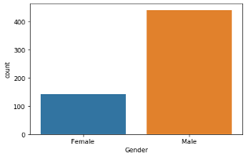

Fig 3.3 EDA2 

LGORITHMS**  

Decision trees
logistic regression
Naive Bayes
random forests
linear and SVMs
Neural Networks

4.**DESIGN**

4.1 UML DIAGRAMS:

The  System  Design  Document  describes  the  system  requirements,  operating environment,  system  and  subsystem  architecture,  files  and  database  design,  input formats, output layouts, human-machine interfaces, detailed design, processing logic, and external interfaces. 

Global Use Case Diagrams:

Identification of actors: 

Actor: Actor represents the role a user plays with respect to the system. An actor interacts with, but has no control over the use cases. 

Graphical representation: 

  

Actor
An actor is someone or something that:Interacts with or uses the system. Provides input to and receives information from the system. 
Is external to the system and has no control over the use cases.  

Actors are discovered by examining: 

- Who directly uses the system? 
- Who is responsible for maintaining the system? 
- External hardware used by the system. 
- Other systems that need to interact with the system. Questions to identify actors: 

Who is using the system? Or, who is affected by the system? Or, which groups need help from the system to perform a task? 

Who  affects  the  system?  Or,  which  user  groups  are  needed  by  the  system  to perform its functions? These functions can be both main functions and secondary functions such as administration. 

Which external hardware or systems (if any) use the system to perform tasks? 

What problems does this application solve (that is, for whom)? 

And, finally, how do users use the system (use case)? What are they doing with the system? 

The actors identified in this system are: 

- System Administrator 
- Customer 
- Customer Care

 Identification of usecases: 

Usecase:  A use case can be described as a specific way of using the system from a user’s (actor’s) perspective. 

 Graphical representation: 

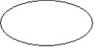

A more detailed description might characterize a use case as: 

- Pattern of behavior the system exhibits 
- A sequence of related transactions performed by an actor and the 

system 

- Delivering  something  of  value  to  the  actor  Use  cases  provide  a 

means to: 

- capture system requirements 
- communicate with the end users and domain experts 
- test the system 

Use cases are best discovered by examining the actors and defining what the actor will be able to do with the system. 

Guide lines for identifying use cases: 

- For each actor, find the tasks and functions that the actor should be able to perform or that the system needs the actor to perform. The use case should represent a course of events that leads to clear goal 

- Name the use cases. 
- Describe the use cases briefly by applying terms with which the user is familiar. This makes the description less ambiguous 

Questions to identify use cases: 

- What are the tasks of each actor? 
- Will any actor create, store, change, remove or read information in the system? 

- What use case will store, change, remove or read this information? 
- Will  any  actor  need  to  inform  the  system  about  sudden  external changes? 
- Does  any  actor  need  to  inform  about certain occurrences in the system? 
- What usecases will support and maintains the system? 

Flow of Events

A flow of events is a sequence of transactions (or events) performed by the system. They typically contain very detailed information, written in terms of what the system should do, not how the system accomplishes the task. Flow of events are created as separate files or documents in your favorite text editor and then attached or linked to a use case using the Files tab of a model element. 

A flow of events should include: 

- When and how the use case starts and ends 
- Use case/actor interactions 
- Data needed by the use case 
- Normal sequence of events for the use case 
- Alternate or exceptional flows Construction of Usecase diagrams: 

Use-case  diagrams  graphically  depict  system  behavior  (use  cases). These diagrams present a high level view of how the system is used as viewed from an outsider’s (actor’s) perspective. A use-case diagram may depict all or some of the use cases of a system. 

A use-case diagram can contain: 

- actors ("things" outside the system) 
- use cases (system boundaries identifying what the system should do) 
- Interactions  or  relationships  between  actors  and  use  cases  in  the 

system including the associations, dependencies, and generalizations. 

Relationships in use cases: 

4.1.3.1 Communication:

The communication relationship of an actor in a usecase is shown by connecting the actor symbol to the usecase symbol with a solid path. The actor is said to communicate with the usecase. 

4.1.3.2 Uses: 

A Uses relationship between the usecases is shown by generalization arrow from the usecase. 

4.1.3.3 Extends:

The  extend  relationship  is  used  when  we  have  one  usecase  that  is similar  to  another  usecase  but  does  a  bit  more.  In  essence  it  is  like subclass. 

4. SEQUENCE DIAGRAMS

A sequence diagram is a graphical view of a scenario that shows object interaction in a time- based sequence what happens first, what happens next. Sequence diagrams establish the roles of objects and help provide essential information to determine class responsibilities and interfaces. There are two main differences between sequence and collaboration diagrams: sequence diagrams show time-based object interaction while collaboration  diagrams  show  how  objects  associate  with  each  other.  A  sequence diagram  has  two  dimensions:  typically,  vertical  placement  represents  time  and horizontal placement represents different objects. 

Object: 

An object has state, behavior, and identity. The structure and behavior of similar objects are defined in their common class. Each object in a diagram indicates some instance of a class. An object that is not named is referred to as a class instance. 

The object icon is similar to a class icon except that the name is underlined: An object's concurrency is defined by the concurrency of its class. 

Message: 

A message is the communication carried between two objects that trigger an event. A message carries information from the source focus of control to the destination focus of control. The synchronization  of  a  message can be  modified  through

the  message specification. Synchronization means a message where the sending object pauses to wait for results. 

Link: 

A link should exist between two objects, including class utilities, only if there is a relationship  between  their  corresponding  classes.  The  existence  of  a  relationship between two classes symbolizes a path of communication between instances of the classes: one object may send messages to another. The link is depicted as a straight line between objects or objects and class instances in a collaboration diagram. If an object links to itself, use the loop version of the icon. 

5. CLASS DIAGRAM: Identification of analysis classes: 

A class is a set of objects that share a common structure and common behavior (the same attributes, operations, relationships and semantics). A class is an abstraction of real-world items. There are 4 approaches for identifying classes: 

1. Noun phrase approach: 
2. Common class pattern approach. 
2. Use case Driven Sequence or Collaboration approach. 
2. Classes , Responsibilities and collaborators Approach 

Noun Phrase Approach: 

The guidelines for identifying the classes: 

- Look for nouns and noun phrases in the usecases. 
- Some classes are implicit or taken from general knowledge. 
- All  classes  must  make  sense  in  the  application  domain;  Avoid computer implementation classes – defer them to the design stage. 
- Carefully choose and define the class names After identifying theclasses we have to eliminate the following types of classes: 
- Adjective classes. Common class pattern approach: 

The following are the patterns for finding the candidate classes: 

- Concept class. 
- Events class. 
- Organization class 
- Peoples class 
- Places class 
- Tangible things and devices class. 

Use case driven approach: 

We have to draw the sequence diagram or collaboration diagram. If there is need for some classes to represent some functionality then add new classes which perform those functionalities. 

CRC approach: 

The process consists of the following steps: 

- Identify classes’ responsibilities ( and identify the classes ) 
- Assign the responsibilities 
- Identify the collaborators. Identification of responsibilities of each 

class: 

The questions that should be answered to identify the attributes and methods of a class respectively are: 

1. What information about an object should we keep track of? 
1. What services must a class provide? Identification of relationships among the classes: 

Three types of relationships among the objects are: Association: How objects are associated? 

Super-sub structure: How are objects organized into super classes and sub classes? Aggregation: What is the composition of the complex classes? 

Association: 

The questions that will help us to identify the associations are: 

1. Is the class capable of fulfilling the required task by itself? 
1. If not, what does it need? 
1. From what other classes can it acquire what it needs? Guidelines for 

identifying the tentative associations: 

- A dependency between two or more classes may be an association. Association often corresponds to a verb or prepositional phrase. 
- A  reference  from  one  class  to  another  is  an  association.  Some associations are implicit or taken from general knowledge. 

Some common association patterns are: 

Location  association  like  part  of,  next  to,  contained  in….. Communication association like talk to, order to …… 

We  have  to  eliminate  the  unnecessary  association  like  implementation associations, ternary or n-ary associations and derived associations. 

Super-sub class relationships: 

Super-sub class hierarchy is a relationship between classes where one class is the parent class of another class (derived class).This is based on inheritance. 

Guidelines for identifying the super-sub relationship, a generalization are

 **Top-down*: 
Look for noun phrases composed of various adjectives in a class name. Avoid excessive refinement. Specialize only when the sub classes have significant behavior. 

**Bottom-up*:

Look for classes with similar attributes or methods. Group them by moving the common  attributes  and  methods  to  an  abstract  class.  You  may  have  to  alter  the definitions a bit. 

Re-usability*:

Move the attributes and methods as high as possible in the hierarchy.

 Multiple inheritances:

Avoid  excessive  use  of  multiple  inheritances.  One  way  of  getting  benefits  of multiple inheritances is to inherit from the most appropriate class and add an object of another class as an attribute. 

Aggregation or a-part-of relationship: 

It represents the situation where a class consists of several component classes. A class that is composed of other classes doesn’t behave like its parts. It behaves very difficultly.  The  major  properties  of  this  relationship  are  transitivity  and  anti symmetry. 

The questions whose answers will determine the distinction between the part and whole relationships are: 

- Does the part class belong to the problem domain? 
- Is the part class within the system’s responsibilities? 
- Does the part class capture more than a single value?( If not then 

simply include it as an attribute of the whole class) 
- Does  it  provide  a  useful  abstraction  in  dealing  with  the  problem domain? There are three types of aggregation relationships. They are: 

Assembly:

It is constructed from its parts and an assembly-part situation physically exists.

Container:

A physical whole encompasses but is not constructed from physical parts.

Collection member:

A conceptual whole encompasses parts that may be physical or conceptual. The container  and  collection  are  represented  by  hollow  diamonds  but  composition  is represented by solid diamond. 

**ClassDiagram:**  

In  software  engineering,  a  class  diagram  in  the  Unified  Modeling  Language (UML) is a type of static structure diagram that describes the structure of a system by showing  the  system's  classes,  their  attributes,  operations  (or  methods),  and  the relationships among the classes. It explains which class contains information. 

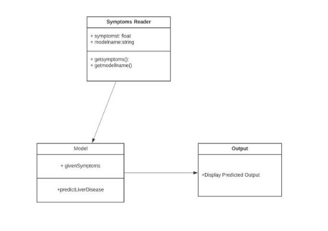

Fig 4.1: Class Diagram 

**Use Case Diagram:**  

A use case diagram at its simplest is a representation of a user's interaction with the system and depicting the specifications of a use case. A use case diagram can portray the different types of users of a system and the various ways that they interact with the system. This type of diagram is typically used in conjunction with the textual use case and will often be accompanied by other types of diagrams as well.  

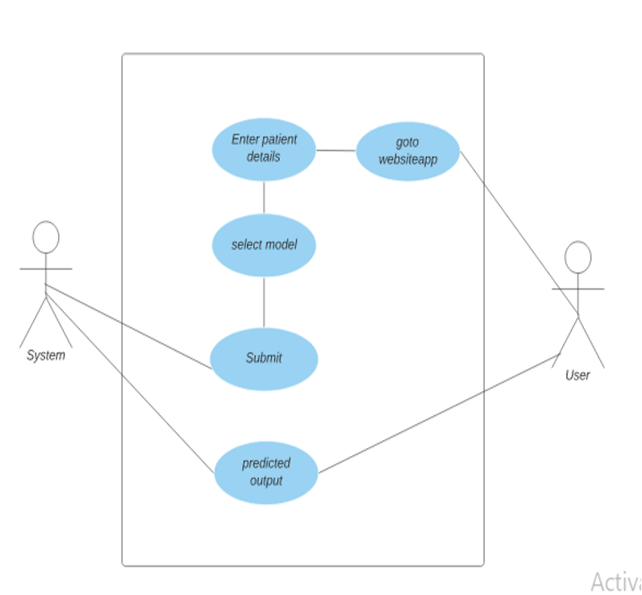

Fig 4.2: Usecase diagram 

 **Sequence Diagram:**  

A sequence diagram is a kind of interaction diagram that shows how processes operate with one another and in what order. It is a construct of a Message Sequence Chart. A sequence diagram shows object interactions arranged in time sequence. It depicts the objects and classes involved in the scenario and the sequence of messages exchanged between the objects needed to carry out the functionality of the scenario. Sequence diagrams are typically associated with use case realizations in the Logical View of the system under development. Sequence diagrams are sometimes called event diagrams, event scenarios, and timing diagrams. 

Fig 4.3:Sequence diagram 

 **State Chart Diagram** 

State chart diagram describes the flow of control from one state to another state. States are defined as a condition in which an object exists and it changes when some event is triggered. The most important purpose of State chart diagram is to model lifetime of an object from creation to termination. 

Fig 4.4:State chart diagram 

 **Activity Diagram:**  

Activity  diagram  is  another  important  diagram  in  UML  to  describe  dynamic aspects of the system. It is basically a flow chart to represent the flow form one activity  to  another  activity.  The  activity  can  be  described  as  an  operation  of  the system. 

Fig 4.5:Activity diagram 

 **Data Flow Diagram:**  

A DFD is a model for constructing and analyzing information processes. DFD illustrates the low of   information in a process depending upon the inputs and outputs. A DFD can also be referred to as a Process Model. A DFD demonstrates business or technical process with the support of the outside data saved, plus the data flowing from the process to another and the end results.  

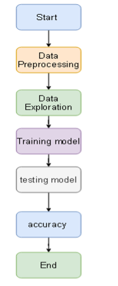

Fig 4.6:Data flow Diagram 

**ARCHITECTURE OF PROJECT** 

The machine  learning  architecture defines  the  various  layers  involved  in the machine  learning cycle  and  involves  the  major  steps  being  carried  out  in  the transformation of raw data into training data sets capable for enabling the decision making of a system. 

Fig 4.7:Architecture diagram 

5. **IMPLEMENTATION** 

ALGORITHOMS:

1.Logistic regression:-  

Logistic regression is a supervised learning classification algorithm used to predict the probability of a target  variable. The nature of target or dependent variable is dichotomous, which means there would be only two possible classes. 

In simple words, the dependent variable is binary in nature having data coded as either 1 (stands for success/yes) or 0 (stands for failure/no). 

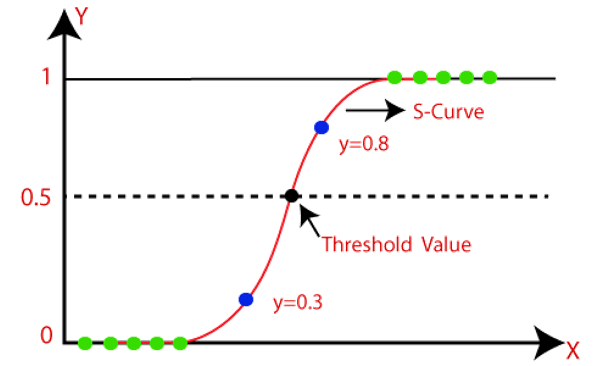

Fig 5.1 Logistic Regression Graph 

2.KNNAlgorithom:-

K Nearest Neighbour is a simple algorithm that stores all the available cases and classifies the new data or case based on a similarity measure. It is mostly used to classifies a data point based on how its neighbours are classified. 

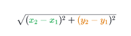

Fig 5.2 KNN Graph

3.Decision Tree:-

Decision  Tree  is  a Supervised  learning  technique that  can  be  used  for  both classification  and  Regression  problems,  but  mostly  it  is  preferred  for  solving Classification  problems.  It  is  a  tree-structured  classifier,  where internal  nodes represent the features of a dataset, branches represent the decision rules and each leaf node represents the outcome. 

In a Decision tree, there are two nodes, which are the Decision Node and Leaf Node. Decision nodes are used to make any decision and have multiple branches, whereas Leaf nodes are the output of those decisions and do not contain any further branches.                      

Fig 5.3 Decision Tree 

4.Random Forest:- 

Random  forest  is  a supervised  learning  algorithm.  The  "forest" it  builds,  is  an ensemble of decision trees, usually trained with the “bagging” method. The general idea of the bagging method is that a combination of learning models increases the overall result. 

Put simply: random forest builds multiple decision trees and merges them together to get a more accurate and stable prediction. 

5.Support Vector Machine** 

A  Support  Vector  Machine  (SVM)  performs  classification  by  finding  the hyperplane that maximizes the margin between the two classes. The vectors (cases) that define the hyperplane are the support vectors. 

A support vector machine is a supervised learning algorithm that sorts data into two categories. It is trained with a series of data already classified into two categories, building the model as it is initially trained. The task of an SVM algorithm is to determine which category a new data point belongs in. This makes SVM a kind of non-binary linear classifier.An SVM algorithm should not only place objects into categories, but have the margins between them on a graph as wide as possible. 

Fig 5.4 SVM 

6.Neural Network:-

The structure of the human brain inspires a Neural Network. It is essentially a Machine  Learning  model  (more  precisely,  Deep  Learning)  that  is  used  in unsupervised learning. A Neural Network is a web of interconnected entities known as nodes wherein each node is responsible for a simple computation. In this way, a Neural Network functions similarly to the neurons in the human brain 

`  `Fig 5.5 Neural Networks 

2. **CODING** 
1.Logistic Regression:-

from sklearn.linear\_model import Logistic Regression clf=LogisticRegression(random\_state=0,solver='lbfgs',multi\_class='multinomial' max\_iter=100) 

clf.fit(X\_train,y\_train) 

y\_pred=clf.predict(X\_test) 

from sklearn.metricsimport accuracy\_score,precision\_score,recall\_score,confusion\_matrix print('Accuracy:',round(accuracy\_score(y\_test,y\_pred)\*100,2)) print('Precision:',round(precision\_score(y\_test,y\_pred)\*100,2))   

print('Recall    :',round(recall\_score(y\_test,y\_pred)\*100,2))   

print('Confusion Matrix: \n',confusion\_matrix(y\_pred,y\_test)) 

2. KNN Algorithm:-

from sklearn.neighbors import KNeighborsClassifier 

from sklearn.model\_selection import cross\_val\_score 

- creating odd list of K for KNN 

neighbors = list(range(1,20,2)) 

- empty list that will hold cv scores 

cv\_scores = [] 

for k in neighbors: 

`     `knn = KNeighborsClassifier(n\_neighbors=k) 

`     `scores = cross\_val\_score(knn, X\_train, y\_train, cv=5, scoring='accuracy')      cv\_scores.append(scores.mean())    

- changing to misclassification error 

MSE = [1 - x for x in cv\_scores] 

- determining best k 

optimal\_k = neighbors[MSE.index(min(MSE))] 

print('\nThe optimal number of neighbors is %d.' % optimal\_k) 

3. Decision Tree:- 

from sklearn.tree import DecisionTreeClassifier      dtclf=DecisionTreeClassifier()  

dtclf.fit(X\_train,y\_train) print('Accuracy:',round(accuracy\_score(y\_test,y\_pred)\*100,2)) print('Precision:',round(precision\_score(y\_test,y\_pred)\*100,2))   print('Recall    :',round(recall\_score(y\_test,y\_pred)\*100,2))   print('Confusion Matrix: \n',confusion\_matrix(y\_pred,y\_test)) 

4. **Random  Forest** 

from sklearn.ensemble import RandomForestClassifier 

from math import sqrt 

from sklearn.metrics import mean\_squared\_error rfclf=RandomForestClassifier(n\_estimators=100,max\_depth=2,random\_state=0) rfclf.fit(X\_train,y\_train) 

y\_pred = rfclf.predict(X\_test) 

5. **Support Vector Machine** 

from sklearn import svm svmclf=svm.SVC(kernel='rbf',gamma='auto',decision\_function\_shape='ovo',prob bility=True) 

svmclf.fit(X\_train,y\_train) 

y\_pred = svmclf.predict(X\_test) print('Accuracy:',round(accuracy\_score(y\_test,y\_pred)\*100,2)) print('Precision:',round(precision\_score(y\_test,y\_pred)\*100,2))   print('Recall    :',round(recall\_score(y\_test,y\_pred)\*100,2))   print('Confusion Matrix: \n',confusion\_matrix(y\_pred,y\_test)) 

6. **Neural Networks** 

from sklearn.neural\_network import MLPClassifier 

from sklearn.metrics import accuracy\_score 

from sklearn.model\_selection import train\_test\_split 

from sklearn.metrics import classification\_report,confusion\_matrix neural = MLPClassifier(max\_iter=350) 

neural.fit(X\_train, y\_train) 

y\_pred = neural.predict(X\_test) 

neural\_score\_test = round(neural.score(X\_test, y\_test) \* 100, 2) print('Neural Test Score: \n', neural\_score\_test) print('Accuracy:',round(accuracy\_score(y\_test,y\_pred)\*100,2)) print('Precision:',round(precision\_score(y\_test,y\_pred)\*100,2)) print('Recall    :',round(recall\_score(y\_test,y\_pred)\*100,2))   print('Confusion Matrix: \n',confusion\_matrix(y\_pred,y\_test)) 

import pickle  pickle.dump(clf,open('log.pkl','wb')) pickle.dump(classifier,open('knn.pkl','wb')) pickle.dump(dtclf,open('decisiontree.pkl','wb')) pickle.dump(rfclf,open('randomforest.pkl','wb')) pickle.dump(nbclf,open('navebais.pkl','wb')) 

pickle.dump(svmclf,open('svm.pkl','wb')) pickle.dump(gbclass,open('gbost.pkl','wb')) pickle.dump(neural,open('neural.pkl','wb')) 

7. **Web App** 

import streamlit as st 

import pickle  

log=pickle.load(open('log.pkl','rb')) knn=pickle.load(open('knn.pkl','rb')) decisiontree=pickle.load(open('decisiontree.pkl','rb')) randomforest=pickle.load(open('randomforest.pkl','rb')) naivebayes=pickle.load(open('navebais.pkl','rb')) svm=pickle.load(open('svm.pkl','rb')) neural=pickle.load(open('neural.pkl','rb')) 

def classify(num,t): 

`     `if (num==1 and t==1): return "The Patient is likely has liver disease";      else : return "The Patient   is likely not having liver disease"; 

def main(): 

`     `st.title("Liver disease Predection") 

`     `html\_temp = """ 

`     `
 

`     `<h2 style="color:white;text-align:center;">Liver disease Predection</h2>      
 

""" 

st.markdown(html\_temp, unsafe\_allow\_html=True) 

activities=['LogisticRegression','KNN','Decisiontree','Randomforest','naivebayes','SV M','Neural networks'] 

option=st.sidebar.selectbox('Which model would you like to use?',activities) st.subheader(option) 

`     `age=st.slider("Enter   age",1,100) 

`     `gender = st.radio("Gender",("Male","Female")) 

`     `Total\_Bilirubin=st.slider('Total\_Bilirubin', 0, 75) 

`     `Direct\_Bilirubin=st.slider('Direct\_Bilirubin', 0, 20) 

`     `Alkaline\_Phosphotase=st.slider('Alkaline\_Phosphotase ', 0, 2100) 

`     `Alamine\_Aminotransferase=st.slider('Alamine\_Aminotransferase ', 0, 2000) 

`     `Aspartate\_Aminotransferase=st.slider('Aspartate\_Aminotransferase  ',  0, 5000) 

Total\_Protiens=st.slider('Total\_Protiens ', 0, 10) 

Albumin=st.slider('Albumin ', 0, 6) Albumin\_and\_Globulin\_Ratio=st.slider('Albumin\_and\_Globulin\_Ratio  ',  0, 

\5) 

`     `if gender=="Female":          gender1=1 

`         `gender2=0 

`     `else: 

`         `gender1=0 

`         `gender2=1 

inputs=[[age,Total\_Bilirubin,Direct\_Bilirubin,Alkaline\_Phosphotase,Alamine\_Am inotransferase, 

Aspartate\_Aminotransferase,Total\_Protiens,Albumin,Albumin\_and\_Globulin\_Ratio,g ender1,gender2]] 

`     `t=(age!=0  and  Total\_Bilirubin!=0  and  Direct\_Bilirubin!=0  and Alkaline\_Phosphotase!=0and Aspartate\_Aminotransferase!=0andTotal\_Protiens!=0andAlbumin!=0andAlbumin\_an d\_Globulin\_Ratio!=0) 

`     `if st.button('Classify'): 

`         `if option=='Logistic Regression': 

`             `st.success(classify(log.predict(inputs),t)) 

`         `elif option=='KNN': 

`             `st.success(classify(knn.predict(inputs),t)) 

`         `elif option=='Decision tree': 

`             `st.success(classify(decisiontree.predict(inputs),t))          elif option=='Random forest': 

`             `st.success(classify(randomforest.predict(inputs),t))          elif option=='naive bayes': 

`             `st.success(classify(naivebayes.predict(inputs),t)) 

`         `elif option=='svm': 

`             `st.success(classify(svm.predict(inputs),t)) 

`         `elif option=='Neural networks': 

`             `st.success(classify(neural.predict(inputs),t))     

if \_\_name\_\_=='\_\_main\_\_':      main() 

**6.TESTING** 

**6.1 SOFTWARE TESTING Testing** 

Testing is a process of executing a program with the aim of finding error. To make our software perform well it should be error free. If testing is done successfully it will remove all the errors from the software. 

**6.1.1 Types of Testing**

1. White Box Testing 
1. Black Box Testing 
1. Unit testing 
1. Integration Testing 
1. Alpha Testing 
1. Beta Testing 
1. Performance Testing and so on 

**White Box Testing**

Testing  technique  based  on  knowledge  of  the  internal  logic  of  an application's  code  and  includes  tests  like  coverage  of  code  statements, branches, paths, conditions. It is performed by software developers 

**Black Box Testing**

A  method  of  software  testing  that  verifies  the  functionality  of  an application  without  having  specific  knowledge  of  the  application's code/internal structure. Tests are based on requirements and functionality. 

**Unit Testing**

Software verification and validation method in which a programmer tests  if  individual  units of  source  code  are  fit  for  use.  It  is  usually conducted by the development team. 

**Integration Testing**

The phase in software testing in which individual software modules are combined and tested as a group. It is usually conducted by testing teams. 

**Alpha Testing**

Type  of  testing  a  software  product  or  system  conducted  at  the developer's site. Usually it is performed by the end users. 

**Beta Testing**

Final testing before releasing application for commercial purpose. It is typically done by end- users or others. 

**Performance Testing**

Functional testing conducted to evaluate the compliance of a system or component  with  specified  performance  requirements.  It  is  usually conducted by the performance engineer. 

**Black Box Testing**

Blackbox testing is testing the functionality of an application without knowing  the  details  of  its  implementation  including  internal  program structure, data structures etc. Test cases for black box testing are created based  on  the  requirement  specifications.  Therefore,  it  is  also  called  as specification-based testing. Fig.4.1 represents the black box testing: 

Fig.6.1:Black Box Testing 

When applied to machine  learning models, black  box testing would mean testing machine learning models without knowing the internal details such as features of the machine learning 

model,  the  algorithm  used  to  create  the  model  etc.  The  challenge, however, is to verify the test outcome against the expected values that are known beforehand. 

Fig.6.2:Black Box Testing for Machine Learning algorithms 

The  above  Fig.4.2  represents  the  black  box  testing  procedure  for machine learning algorithms.

Fig.6.3:Black box Testing

|**Input** |**Actual Output** |**Predicted Output** |
| - | :- | :- |
|[26,1,25,13,1002,800,2000,5,3,1] |0 |0 |
|[60,0,60,25,500,600,1005,6,2,1] |1 |1 |

The model gives out the correct output when different inputs are given which are mentioned in Table 6.3. Therefore the program is said to be executed as expected or correct program 

Fig 6.4 Testing 

In  the  work,  we  utilized  some  factual  estimations  that  measure  the  test execution of various classification algorithms. The performance of the classification methods  was  assessed  by  various  evaluation  procedures,  for  example,  accuracy, precision, recall and f1 measure. Consequently, the exhibition evaluation variables are determined by the confusion matrix. Here, 

**True Positives (TP)** - These are the correctly predicted positive values which means that the value of actual class is yes and the value of predicted class is also yes. E.g. if actual class value indicates that this passenger survived and predicted class tells you the same thing. 

**True  Negatives  (TN)** -  These  are  the  correctly  predicted  negative  values which means that the value of actual class is no and value of predicted class is also no. E.g. if actual class says this passenger did not survive and predicted class tells you the same thing. False  positives  and  false  negatives,  these  values  occur  when  your  actual  class contradicts with the predicted class. 

**False Positives (FP)** – When actual class is no and predicted class is yes. E.g. if actual class says this passenger did not survive but predicted class tells you that this passenger will survive. 

**False Negatives (FN)** – When actual class is yes but predicted class in no. E.g. if actual class value indicates that this passenger survived and predicted class tells you that passenger will die. Once  you  understand  these  four  parameters  then  we  can  calculate  Accuracy, Precision, Recall and F1 score. 

**Accuracy** - Accuracy is the most intuitive performance measure and it is simply a ratio of correctly predicted observation to the total observations. One may think that, if we have high accuracy then our model is best. Yes, accuracy is a great measure but only  when  you  have  symmetric  datasets  where  values  of  false  positive  and  false negatives  are  almost  same.  Therefore,  you  have  to  look  at  other  parameters  to evaluate the performance of your model. For our model, we have got 0.803 which means our model is approx. 80% accurate. 

Accuracy = TP+TN/TP+FP+FN+TN 

**Precision** - Precision is the ratio of correctly predicted positive observations to the total predicted positive observations. The question that this metric answer is of all passengers  that  labeled  as  survived,  how  many  actually  survived?  High  precision relates to the low false positive rate. We have got 0.788 precision which is pretty good. 

Precision = TP/TP+FP 

**Recall (Sensitivity)**  -  Recall  is  the  ratio  of  correctly  predicted  positive observations to the all observations in actual class - yes. The question recall answers is: Of all the passengers that truly survived, how many did we label? We have got recall of 0.631 which is good for this model as it’s above 0.5. 

Recall = TP/TP+FN 

**F1 score** - F1 Score is the weighted average of Precision and Recall. Therefore, this score takes both false positives and false negatives into account. Intuitively it is not as easy to understand as accuracy, but F1 is usually more useful than accuracy, 

especially  if you have  an uneven class distribution. Accuracy works best if false positives and false negatives have similar cost. If the cost of false positives and false negatives are very different, it’s better to look at both Precision and Recall. In our case, F1 score is 0.701. 

F1 Score = 2\*(Recall \* Precision) / (Recall + Precision) 

**Confusion Matrix**  

A confusion matrix is a tabular summary of the number of correct and incorrect predictions  made  by  a  classifier.  It  is  used  to  measure  the  performance  of  a classification model. 

 
 Fig 6.5 Confusion Matrix 
 

True Positive (TP): The result of prediction correctly identifies that a patient has liver disease.  

False Positive (FP): The result of prediction incorrectly identifies that a patient has liver disease. True  

Negative (TN): The result of prediction correctly rejects that a patient has liver disease.  

False Negative (FN): The result of prediction incorrectly rejects that a patient has liver disease.  

**Logistic Regression** 

Accuracy : 76.07 Precision: 75.65 Recall    : 100.0 f1 score : 86.14 Confusion Matrix:    [[87 28] [ 0   2]] 

**KNN** 

Accuracy : 75.21 Precision: 77.36 Recall    : 94.25 f1 score : 84.97 Confusion Matrix:    [[82 24] [ 5   6]] 

**Decision Tree** 

Accuracy : 71.79 Precision: 84.62 Recall    : 75.86 f1 score : 80.0 Confusion Matrix:    [[66 12] [21 18]] 

**Random Forest** 

Accuracy : 74.36 Precision: 74.36 Recall    : 100.0 f1 score : 85.29 Confusion Matrix:    [[87 30] [ 0   0]] 

Fig 6.6 Metrics Table  

7. **RESULTS AND DISCUSSIONS** \

1.**Import required package and extracting the data set 

Fig.7.1 import modules 

2. **Data Processing 

Fig.7.2 Data Processing 

3. **Data Visualization  

Fig.7.3 Data visualization 

Fig.7.4 Data visualization

4. **Feature Scaling 

Fig.7.5 Feature Scaling 

5. **MODELS** 

1.**Logistic Regression:- 

   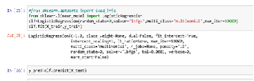

Fig.7.6 Logistic regression 

2.**Decision Tree:-

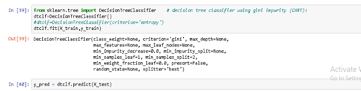

Fig.7.7 Decision Tree 

3.**Random Forest 

Fig.7.8 Random Forest  

4.**SVM:- 

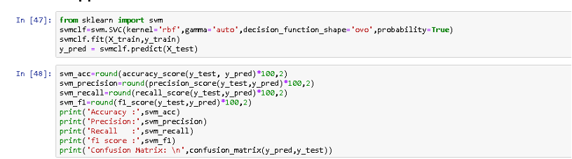

Fig.7.9 Svm 

5.**Neural Networks 

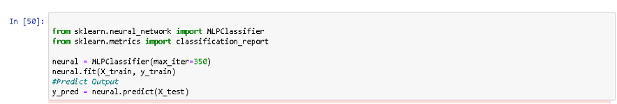

Fig.7.10 Neural Networks  

6.**KNN

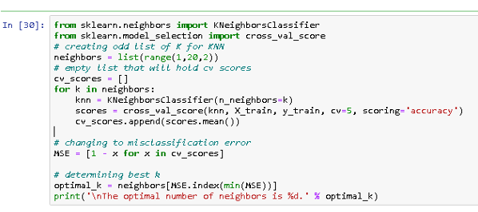

Fig.7.11 Knn

Fig.7.12. Output 

Fig.7.13. Output

8. **CONCLUSIONS AND FUTURE SCOPE** 

The dataset for this problem is the ILPD (Indian Liver Patient Dataset) taken from the UCI Machine Learning Repository. Region specified in this dataset is of Andhra Pradesh of year 2017. 

Initially, the data set was explored and made ready to be fed into the classifiers. This was achieved by removing some rows containing null values, transforming some columns  which  were  showing  skewness  and  using  appropriate  methods  (one-hot encoding) to convert the labels so that they can be useful for classification purposes. Performance metrics on which the models would be evaluated were decided. The data  set was then split into a training and testing set.  

Then the training data is fed to the different models Logistic Regression, KNN, Decision Tree, Random Forest, Support Vector Machine, Neural Networks. And then these models are tested with the testing data using different measuring metrics like accuracy, precision, recall, f1- score. Then the models are converted into pickle file and deployed in web using Heroku Platform as a Service.   

This project aims to predict the liver disease on the basis of the symptoms. The project is designed in such a way that the system takes symptoms from the user as input  and  produces  output  i.e.  predict  disease.  In  conclusion,  for  disease  risk modelling, the accuracy of risk prediction depends on the diversity feature of the hospital data. 

As our dataset is small it’s training dataset is similar to test dataset so we cannot rely on this model for predicting accuracy for large dataset. We need more precised data set containing larger values and attributes to classify values and get best accuracy 

9. **REFERENCES** 

1. K. Sumeet, J.J. Larson, B. Yawn, T.M. Therneau, W.R. Kim, Underestimation of liver-related mortality in the United States. Gastroenterology;(2013) 145:375–382, e371–372.  
2. A.A. Mokdad, A.D. Lopez, S. Shahraz, R. Lozano, A.H. Mokdad, J. Stanaway, et al, Liver cirrhosis mortality in 187 countries between 1980 and 2010: a systematic analysis. BMC Med 2014; 12:145.  
3. Byass, Peter, The global burden of liver disease: a challenge for methods and for public health. BMC medicine 12.1 (2014); 159.  
4. L. A. Auxilia, Accuracy Prediction Using Machine Learning Techniques for 
Indian  Patient  Liver  Disease.  2018  2nd  International  Conference  on  Trends  in Electronics and Informatics (ICOEI). IEEE (2018) 
5. Hashem, M. Esraa, S. Mai, A study of support vector machine algorithm for liver disease diagnosis. American Journal of Intelligent Systems 4.1 (2014); 9-14.  
6. P. Sajda, "Machine learning for detection and diagnosis of disease." Annu. Rev.Biomed. Eng. 8 (2006); 537-565.  
7. UCI  Machine  Learning  Repository.  ILPD  (Indian  Liver  Patient  Dataset) DataSet.https://archive.ics.uci.edu/ml/datasets/ILPD+(Indian+Liver +Patient+Dataset)  
8. Logistic Regression, Retrieve from: HTTPS://WWW.SAEDSAYAD.COM/LOGISTIC  \_REGRESSION.HTM,  LAST Accessed: 5 Octobor,2020 
9. L.  Breiman,  Random  Forests.  Machine  Learning,  45(1),  (2001);  5–32.https://doi.org/10.1023/A:1010933404324  
10. Decision Trees, Retrieve from: https://dataaspirant.com/2017/01/30/how-decision-treealgorithm-works/, LastAccessed: 5 Octobor,2020 
11. Support vector machine, Retrieve from:  http://www.statsoft.com/textbook/support-vectormachines 
11. V. Vapnik, I. Guyon, T. H.-M, Learn, and undefined 1995. Support vector machines. statweb.stanford.edu (1995).  
13. Zhang  M,  Zhou  Z,  "ML-KNN:  A  lazy  learning  approach  to  multi-label learning." Pattern recognition40.7:(2007); 2038-2048.  
